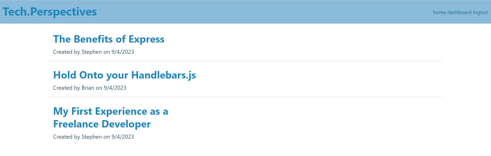

# Tech.Perspectives

## Description

I've been looking for a good tech blog that focuses on the perspectives and stories of new developers breaking into the field for the first time. I decided to create a clean, simple blog that you can use to share your experience, as well as communicate and connect with other like-minded developers online. This was also an opportunity to build my own front and backend code with authentification. 

## Installation

N/A

## Usage

You can read the existing blogs by visiting the homepage and clicking on a title. In order to post, or leave comments you'll have to sign up with the login link at the top of the page. There will be an option to sign up from the login page. You can update and delete blogs from your dashboard page, and you can delete comments by visiting the post where you left the comment. 

## Features

Sign up on the login page
Create, edit, and delete blog posts
Comment on other's posts
